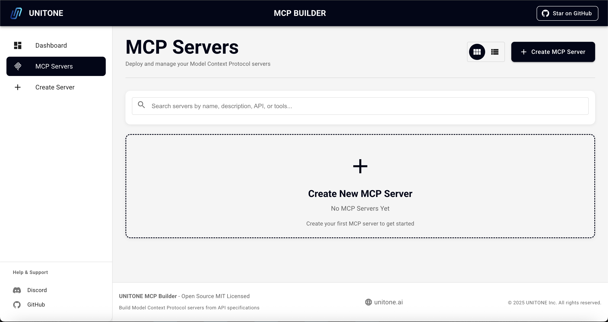
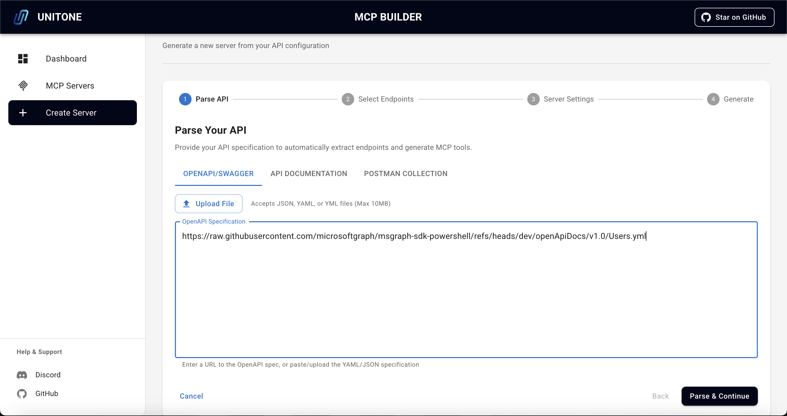
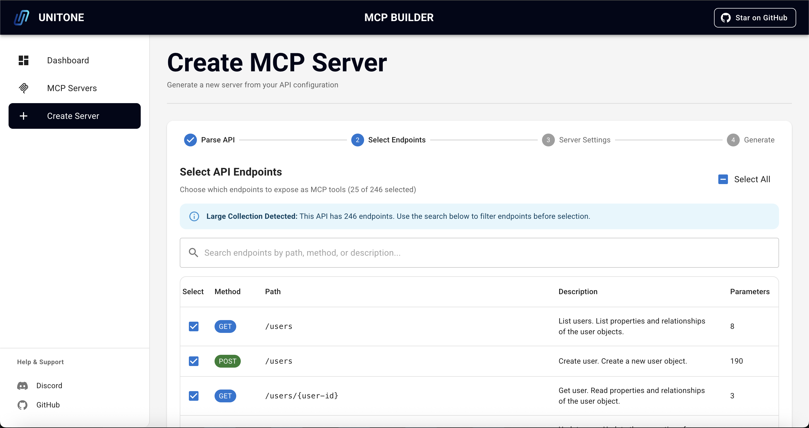
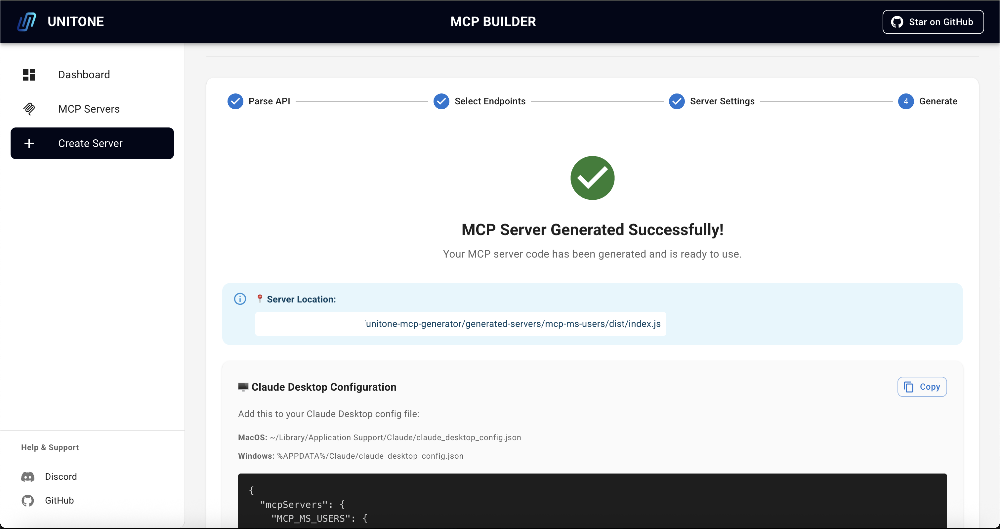
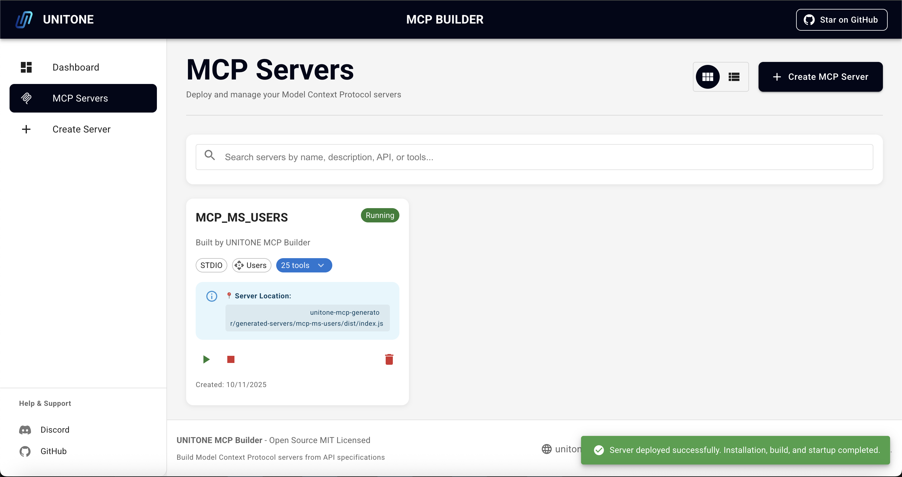

# UNITONE MCP Builder

**Transform any API into a Model Context Protocol (MCP) server with an intuitive web portal.**

Generate MCP servers from OpenAPI/Swagger specs, Postman collections, or API documentation. Make your APIs accessible to AI assistants through natural language interactions.

[](https://nodejs.org)
[](https://www.typescriptlang.org/)
[](https://reactjs.org/)
[](https://opensource.org/licenses/MIT)
[](https://modelcontextprotocol.io/)

## Built With

- **Backend**: Node.js + TypeScript + Express.js
- **Frontend**: React 18 + Material-UI + Vite
- **Database**: better-sqlite3
- **MCP SDK**: [@modelcontextprotocol/sdk](https://www.npmjs.com/package/@modelcontextprotocol/sdk) v1.20+
- **Template Engine**: Handlebars
- **Type Safety**: TypeScript + Zod

## ⚠️ Important: Local Development Tool

**UNITONE MCP Builder is designed for local development use only.**

This is the **open source version** intended for single-user local development environments, while we welcome contributors! 

If you require:
- Hosted/managed MCP server generation
- Public server deployment with authentication
- Extended security features
- Enterprise support
- Team collaboration features

Please contact the **UNITONE team** at [https://unitone.ai](https://unitone.ai) for our enterprise solutions.

## Table of Contents

- [Features](#features)
- [Quick Start](#quick-start)
- [Admin Portal Guide](#admin-portal-guide)
- [Usage](#usage)
  - [Option 1: Quick Start with OpenAPI Spec](#option-1-quick-start-with-openapi-spec)
  - [Option 2: Using Plain Text Documentation](#option-2-using-plain-text-documentation)
  - [Option 3: Import Postman Collection](#option-3-import-postman-collection)
  - [Build and Deploy Your MCP Server](#build-and-deploy-your-mcp-server)
- [Using Generated Servers](#using-generated-servers)
- [Best Practices](#best-practices)
- [Project Structure](#project-structure)
- [API Endpoints](#api-endpoints)
- [Development](#development)
- [Tech Stack](#tech-stack)
- [Troubleshooting](#troubleshooting)
- [Contributing](#contributing)
- [License](#license)
- [Resources](#resources)
- [Support](#support)

## Features

- 🚀 **Multiple Input Formats** - OpenAPI/Swagger (JSON/YAML), Postman collections, or plain text API docs
- 🎨 **Admin Dashboard** - Beautiful Material-UI interface for managing API configurations and MCP servers
- 🔧 **STDIO Transport** - Generate servers compatible with any MCP-compatible client
- 🔐 **Authentication Support** - Bearer tokens, API keys, and OAuth2 client credentials
- 🛠️ **Auto-generate Tools** - Automatically create MCP tools from API endpoints
- 📦 **One-Click Deployment** - Deploy and manage servers directly from the dashboard
- ✅ **Type Safe** - Full TypeScript support with auto-generated types
- 🔄 **Path Parameters** - Automatic path parameter substitution (e.g., `/users/{id}`)
- 🧩 **OpenAPI $ref Resolution** - Resolves component references in specifications
- 📊 **Large-Scale APIs** - Tested with 200+ endpoint APIs (Microsoft Graph)

## Quick Start

### Prerequisites

- Node.js >= 20.0.0
- npm >= 9.0.0

### Installation

```bash
# Clone the repository
git clone https://github.com/UnitOneAI/MCPBuilder.git
cd MCPBuilder

# Install dependencies
npm install

# Start the application
npm run dev
```

The dashboard will be available at `http://localhost:5173` and the API server at `http://localhost:3000`.

## Admin Portal Guide

Visual walkthrough of creating and deploying an MCP server using the admin portal.

### 1. MCP Servers Dashboard

Start from the MCP Servers page where you can view all your servers and create new ones.



### 2. Parse Your API

Provide your API specification using OpenAPI/Swagger, API Documentation, or Postman Collection. The parser will automatically extract endpoints and generate MCP tools.



### 3. Select Endpoints

Choose which endpoints to expose as MCP tools. The portal shows endpoint details including method, path, description, and parameters. Use the search and filter features for large APIs.



### 4. Server Generated

Once generation is complete, you'll see the server location and configuration details. The portal provides ready-to-use configuration for your MCP client.



### 5. Deploy and Run

Deploy your server with one click. The portal handles installation, building, and startup automatically. Monitor server status and manage deployments from the dashboard.



## Usage

### Option 1: Quick Start with OpenAPI Spec

The fastest way to get started is with an OpenAPI/Swagger specification.

**Example - Microsoft Graph Users API:**

1. Navigate to **"Create Server"** in the dashboard
2. Click **"OpenAPI/Swagger"** tab
3. Paste the spec URL or upload file:
   ```
   https://raw.githubusercontent.com/microsoftgraph/msgraph-sdk-powershell/dev/openApiDocs/v1.0/Users.yml
   ```
4. Click **"Parse & Create Configuration"**
5. Select the endpoints you want (e.g., GET /users, GET /users/{id})
6. Configure server:
   - **Name**: `msgraph-users`
   - **Description**: Microsoft Graph Users API
   - **Auth**: OAuth 2
7. Click **"Generate"**

Your MCP server will be generated in `generated-servers/msgraph-users/`.

**Available Microsoft Graph APIs:**
- Users: `https://raw.githubusercontent.com/microsoftgraph/msgraph-sdk-powershell/dev/openApiDocs/v1.0/Users.yml`
- Groups: `https://raw.githubusercontent.com/microsoftgraph/msgraph-sdk-powershell/dev/openApiDocs/v1.0/Groups.yml`
- Mail: `https://raw.githubusercontent.com/microsoftgraph/msgraph-sdk-powershell/dev/openApiDocs/v1.0/Mail.yml`
- Calendar: `https://raw.githubusercontent.com/microsoftgraph/msgraph-sdk-powershell/dev/openApiDocs/v1.0/Calendar.yml`
- [View all specs](https://github.com/microsoftgraph/msgraph-sdk-powershell/tree/dev/openApiDocs/v1.0)

### Option 2: Using Plain Text Documentation

If you don't have an OpenAPI spec, you can paste API documentation or upload file:

```
GET /users - Get all users
- page (number) - Page number (optional)
- limit (number) - Items per page (optional)

POST /users - Create a new user
- name (string) - User's name (required)
- email (string) - User's email (required)

GET /users/{id} - Get user by ID
- id (string) - User ID (required)
```

### Option 3: Import Postman Collection

Simply paste your exported Postman collection JSON or upload file.

### Build and Deploy Your MCP Server

After generation is complete:

1. Navigate to the **"MCP Servers"** section in the admin portal
2. Your server will now be shown with status **"Ready"**
3. Click **"Deploy"** to start the server
4. If deployment is successful, the status will change from **"Ready"** to **"Running"**

The server is now ready to use with any MCP client. Environment variables (API_BASE_URL, API_TOKEN, etc.) are automatically passed from your MCP client configuration - no manual export needed!

## Using Generated Servers

All generated servers use **STDIO transport**, compatible with any MCP-enabled application.

### MCP Client Configuration

Configure your MCP-compatible client to use the generated server. Most clients follow a similar configuration pattern:

**Example configuration:**

```json
{
  "mcpServers": {
    "my-api-server": {
      "command": "node",
      "args": ["/absolute/path/to/generated-servers/my-api-server/dist/index.js"],
      "env": {
        "API_BASE_URL": "https://api.example.com",
        "API_TOKEN": "your_bearer_token_here"
      }
    }
  }
}
```

**Key configuration elements:**
- **command**: `node`
- **args**: Absolute path to `dist/index.js` in your generated server
- **env**: Environment variables for API configuration

Refer to your MCP client's documentation for specific configuration file locations and format. Generated servers include a `.vscode/mcp.json` file as a reference.

**Note:** When using with an MCP client (like Claude Desktop), environment variables are automatically passed from the client configuration. Manual export is only needed for local testing.

## Best Practices

### Tool Count Recommendations

When creating MCP servers, the number of tools you expose significantly impacts performance and accuracy:

**Optimal Range (Recommended): Under 40 tools**
- Best performance and tool selection accuracy
- AI assistants can effectively navigate and choose the right tools
- Faster response times and lower resource usage

**Warning Range: 40-100 tools**
- Server will function but may experience reduced performance
- Tool selection accuracy may decrease as the AI has more options to evaluate
- Consider splitting into multiple focused servers if possible

**Critical Range: 100+ tools**
- Significant performance degradation likely
- Poor tool selection accuracy due to overwhelming number of options
- Strongly recommended to refactor into multiple servers

### Creating Multiple Focused Servers

For large APIs (100+ endpoints), we recommend:

1. **Group by functionality** - Organize endpoints into logical domains
   - Example: `msgraph-users`, `msgraph-mail`, `msgraph-calendar`

2. **Split by use case** - Create servers for specific workflows
   - Example: `api-read-operations`, `api-write-operations`

3. **Separate by resource type** - Divide by primary entities
   - Example: `api-customers`, `api-orders`, `api-inventory`

**Benefits of multiple servers:**
- Each server stays under the 40-tool optimal threshold
- Improved tool selection accuracy and performance
- Users can enable only the servers they need
- Easier to maintain and update individual servers
- Better error isolation and debugging

### Large-Scale API Example

For the Microsoft Graph API (200+ endpoints), instead of one massive server:

```bash
# ❌ Avoid: Single server with 200+ tools
msgraph-all-api

# ✅ Recommended: Multiple focused servers
msgraph-users          # 15 tools - User management
msgraph-mail           # 22 tools - Email operations
msgraph-calendar       # 18 tools - Calendar operations
msgraph-groups         # 12 tools - Group management
msgraph-files          # 25 tools - OneDrive operations
```

The portal will automatically warn you when selecting more than 40 endpoints and provide guidance on creating multiple focused servers.

## Project Structure

```
MCPBuilder/
├── src/
│   ├── server/                      # Express backend API
│   │   ├── routes/                  # API route handlers
│   │   │   ├── apiConfigs.ts        # API configuration endpoints
│   │   │   ├── mcpServers.ts        # MCP server management
│   │   │   ├── deployments.ts       # Server deployment/build
│   │   │   └── parser.ts            # OpenAPI/Postman parsers
│   │   ├── utils/                   # Server utilities
│   │   │   └── logger.ts            # File-based logging
│   │   ├── database.ts              # SQLite database operations
│   │   └── index.ts                 # Server entry point
│   ├── client/                      # React frontend
│   │   ├── components/              # Reusable UI components
│   │   ├── pages/                   # Page components
│   │   ├── services/                # API service layer
│   │   ├── assets/                  # Static assets (images, etc.)
│   │   ├── theme.ts                 # Material-UI theme config
│   │   └── App.tsx                  # Main app component
│   ├── generator/                   # MCP generator core
│   │   ├── McpGenerator.ts          # Code generator
│   │   ├── ApiParser.ts             # API specification parser
│   │   └── handlebars-helpers.ts    # Custom Handlebars helpers
│   ├── templates/                   # Handlebars templates for generated code
│   └── types/                       # Shared TypeScript type definitions
├── generated-servers/               # Generated MCP servers output
├── logs/                            # Server and deployment logs
└── data/                            # SQLite database files
```

## API Endpoints

### Core APIs

**API Configurations**
- `GET /api/configs` - List all API configurations
- `GET /api/configs/:id` - Get API configuration by ID
- `POST /api/configs` - Create API configuration
- `PUT /api/configs/:id` - Update configuration
- `DELETE /api/configs/:id` - Delete configuration

**MCP Servers**
- `GET /api/servers` - List all MCP servers
- `GET /api/servers/:id` - Get MCP server by ID
- `POST /api/servers` - Create MCP server
- `PUT /api/servers/:id` - Update MCP server
- `POST /api/servers/:id/generate` - Generate server code
- `DELETE /api/servers/:id` - Delete server

**Deployments (STDIO Build Only)**
- `GET /api/deployments/server/:serverId` - Get deployment status
- `POST /api/deployments/:serverId/deploy` - Build STDIO server
- `POST /api/deployments/:serverId/stop` - Stop deployment process

**Parsers**
- `POST /api/parser/openapi` - Parse OpenAPI specification (URL or JSON)
- `POST /api/parser/postman` - Parse Postman collection

## Development

```bash
# Run both backend and frontend
npm run dev

# Run backend only
npm run dev:server

# Run frontend only
npm run dev:client

# Build for production
npm run build

# Type checking
npm run type-check

# Lint code
npm run lint

# Format code
npm run format
```

## Tech Stack

**Backend**
- Node.js + TypeScript
- Express.js (REST API server)
- better-sqlite3 (embedded database)
- Handlebars (template engine)
- Zod (schema validation)
- Axios (HTTP client)

**Frontend**
- React 18
- Material-UI (MUI) + Emotion (CSS-in-JS)
- TanStack Query (React Query)
- React Router (routing)
- React Hook Form (form handling & validation)
- Zustand (state management)
- Notistack (toast notifications)
- Vite + SWC (fast Rust-based build tool)

**MCP Integration**
- [@modelcontextprotocol/sdk](https://www.npmjs.com/package/@modelcontextprotocol/sdk) v1.20+

## Troubleshooting

**Server won't start**
- Check that ports 3000 and 5173 are available
- Ensure Node.js >= 20.0.0 is installed
- Try `npm install` again

**Generated server build fails**
- Navigate to the generated server directory
- Run `npm install` to ensure dependencies are installed
- Check for TypeScript errors with `npm run type-check`

**MCP client can't find the server**
- Verify the path in your MCP client config is absolute, not relative
- Ensure the server is built (`npm run build` in the generated server directory)
- Check that environment variables are set correctly in the config
- Restart your MCP client after configuration changes

**API authentication errors**
- Verify your API token/key is valid and not expired
- Ensure `API_TOKEN` or `API_KEY` is properly set in environment variables
- Check your API provider's authentication requirements

## Contributing

We welcome contributions! Please see [CONTRIBUTING.md](CONTRIBUTING.md) for detailed guidelines.

## License

MIT License - see [LICENSE](LICENSE) file for details.

## Resources

- [Model Context Protocol Docs](https://modelcontextprotocol.io/)
- [OpenAPI Specification](https://swagger.io/specification/)
- [MCP Clients](https://modelcontextprotocol.io/clients) - List of compatible MCP clients

## Support

- 🐛 **Bug reports**: [GitHub Issues](https://github.com/UnitOneAI/MCPBuilder/issues)
- 💬 **General questions**: [GitHub Discussions](https://github.com/UnitOneAI/MCPBuilder/discussions)
- 💬 **Community**: [UNITONE Discord](https://discord.gg/zA5zUe7Jqr)
- 🔒 **Security issues**: security@unitone.ai
- 📧 **Contact**: [UnitOne AI](https://unitone.ai)

---

**Built by [UnitOne AI](https://unitone.ai)** | Powered by the [Model Context Protocol](https://modelcontextprotocol.io/)
